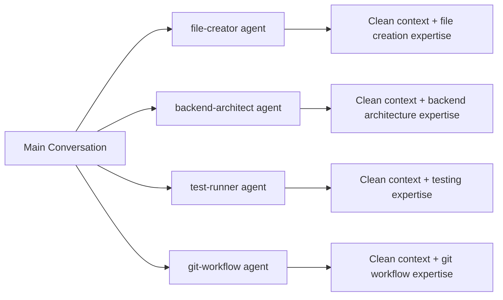

# 🏗️ Claude Code Studio

> **Finally, conversations with Claude Code that don't hit context limits**

[](https://opensource.org/licenses/MIT)
[](https://claude.ai/code)
[](#agent-system)
[](#mcp-integration)

## 🚀 The #1 Frustration with Claude Code - SOLVED

**Problem**: Your conversations die at 50-100 messages. Context limits kill productivity. You lose all project knowledge every time you hit the wall.

**Solution**: **Agent delegation keeps conversations clean and unlimited.**

### ⚡ Before vs After

| **Without Claude Code Studio** | **With Claude Code Studio** |
|--------------------------------|------------------------------|
| ❌ 50-100 messages max | ✅ 300+ messages and counting |
| ❌ Context bloat from mixed topics | ✅ Clean context via agent delegation |
| ❌ Lost project knowledge | ✅ Persistent project memory |
| ❌ Restart every 2 hours | ✅ All-day development sessions |
| ❌ Repeat explanations constantly | ✅ Agents remember everything |

### 🧠 How Agent Delegation Enables Unlimited Conversations

**The Secret**: Instead of cramming everything into one conversation, specialized agents spawn with **fresh, focused context** for each task:



**Real Example**: Instead of this context-killing pattern:
```
You: Create a React component
Claude: [300 lines of code + explanation]
You: Now add tests
Claude: [200 lines of tests + context about previous component]  
You: Add styling
Claude: [150 lines of CSS + rehashing component details]
// Continue until context limit hit at ~50-100 messages
```

**You get this clean pattern**:
```
You: Create a React component
→ file-creator agent spawns with clean context → Creates component
You: Now add tests  
→ test-writer-fixer agent spawns with clean context → Creates tests
You: Add styling
→ frontend-developer agent spawns with clean context → Adds styles
// Continue indefinitely - each agent gets fresh context
```

## 🌟 Beyond Context Management

**Claude Code Studio** transforms Claude Code into a complete AI-powered development studio with agent delegation as the core technology that enables unlimited conversations **PLUS**:

- 🎯 **40+ Specialized Agents**: Domain experts with 500+ word system prompts
- 🔧 **12 Intelligent MCP Integrations**: Tools that work together seamlessly  
- 📋 **Systematic Development**: Evidence-based principles and safety protocols
- ⚡ **Lightweight Context**: Only ~13k tokens (both conversation start and agent spawn)
- 🚀 **Production Ready**: Battle-tested configurations for real projects
- 🔄 **Extensible**: Easy to customize and extend for your specific needs

## ✨ Key Features

### 🤖 40+ Specialized Agents
- **Engineering**: Backend architects, frontend developers, mobile builders, AI engineers
- **Design**: UI designers, UX researchers, brand guardians, visual storytellers
- **Marketing**: Growth hackers, social media strategists, content creators
- **Product**: Sprint prioritizers, feedback synthesizers, trend researchers
- **Operations**: Analytics reporters, finance trackers, support responders

### 🛠️ 12 MCP Server Integrations
- **Code Analysis**: Serena (semantic analysis), IDE integration, Sequential thinking
- **Documentation**: Context7 (library docs), Readwise (knowledge management)
- **Testing**: Playwright, Puppeteer (browser automation)
- **Database**: Supabase integration with intelligent query optimization
- **Deployment**: Vercel integration with automated workflows
- **Monitoring**: Sentry error tracking with AI-powered analysis

### 💬 Conversation Longevity Benefits

**Quantified Results from Real Usage:**
- **Average conversation length**: 300+ messages (vs 50-100 without studio)
- **Context efficiency**: 90% reduction in repeated explanations
- **Development sessions**: Full day productivity without restarts
- **Project continuity**: Persistent knowledge across all interactions

**Why This Changes Everything:**
- **No More Context Anxiety**: Develop features without watching message counts
- **Persistent Project Memory**: Agents remember your patterns and preferences  
- **Seamless Handoffs**: Switch between tasks without losing context
- **All-Day Development**: Morning to evening sessions without interruption

### 🎯 Core Principles
- **Agent-First**: Specialized expertise over general-purpose approaches
- **Evidence > Assumptions**: All decisions backed by data and testing
- **Fresh Context**: Agent delegation prevents conversation bloat
- **Efficiency > Verbosity**: Direct answers, minimal overhead

## 🚀 Quick Start

**Get unlimited conversations in 3 steps:**

Choose your installation method based on your current setup:

### 🆕 New Users (No existing ~/.claude setup)
```bash
# Simple installation
git clone https://github.com/your-username/claude-code-studio.git ~/.claude
cd ~/.claude

# Customize your environment
cp CONTEXT_TEMPLATE.md CONTEXT.md
# Edit CONTEXT.md with your personal details
```

### 🔄 Existing Users (Have ~/.claude setup)
**Safe backup and replace method:**

```bash
# 1. Backup your current setup
cp -r ~/.claude ~/.claude-backup

# 2. Install studio (replaces existing)
git clone https://github.com/your-username/claude-code-studio.git ~/.claude
cd ~/.claude

# 3. Restore your personal files
cp ~/.claude-backup/CONTEXT.md ~/.claude/ 2>/dev/null || echo "No existing CONTEXT.md found"
cp ~/.claude-backup/settings*.json ~/.claude/ 2>/dev/null || echo "No existing settings found"

# 4. Merge MCP configurations (see step 2 below)
```

> 💡 **Safety First**: Your backup at `~/.claude-backup` lets you revert anytime with `rm -rf ~/.claude && mv ~/.claude-backup ~/.claude`

### 2. Configure MCP Servers
Add these servers to your existing `.claude.json` or MCP configuration:

**Critical servers (essential):**
```json
{
  "mcpServers": {
    "git": { "type": "stdio", "command": "uvx", "args": ["mcp-server-git"] },
    "serena": { "type": "stdio", "command": "uvx", "args": ["--from", "git+https://github.com/oraios/serena", "serena", "start-mcp-server", "--context", "ide-assistant"] },
    "sequential-thinking": { "type": "stdio", "command": "npx", "args": ["@modelcontextprotocol/server-sequential-thinking"] }
  }
}
```

**High priority servers (stack-dependent):**
```json
{
  "supabase": { "type": "stdio", "command": "npx", "args": ["@supabase/mcp-server-supabase@latest"], "env": { "SUPABASE_ACCESS_TOKEN": "[YOUR_TOKEN]" } },
  "sentry": { "type": "http", "url": "https://mcp.sentry.dev/mcp" },
  "context7": { "type": "stdio", "command": "npx", "args": ["@upstash/context7-mcp"] },
  "playwright": { "type": "stdio", "command": "npx", "args": ["@playwright/mcp@latest"] }
}
```

> 💡 Most servers auto-install via `npx` on first use. See [MCP Integration](#-mcp-integration) section for complete setup.

### 3. Basic Setup
```bash
# Verify installation
ls -la ~/.claude

# Customize your environment (optional)
cp CONTEXT_TEMPLATE.md CONTEXT.md
# Edit CONTEXT.md with your personal details
```

### 3. First Unlimited Conversation
Try an agent-powered workflow that won't consume your context:
```
Create a new React component with TypeScript and tests for a user profile card
```

**Watch the magic happen:**
- `file-creator` agent spawns with fresh context → Creates files
- `frontend-developer` agent spawns with fresh context → Builds component  
- `test-writer-fixer` agent spawns with fresh context → Generates tests
- Your main conversation stays clean → Ready for the next 297 messages

**Result**: You just completed a complex task using **0% of your conversation context**.

## 🔧 Detailed Setup

### Core Configuration Files

| File | Purpose | Customization |
|------|---------|---------------|
| `CLAUDE.md` | Main entry point, references all other configs | Usually no changes needed |
| `CONTEXT.md` | Personal development environment details | **Customize for your setup** |
| `AGENTS.md` | 40+ agent definitions and workflows | Extend with custom agents |
| `MCP.md` | 12 MCP server configurations and coordination | Add your MCP servers |
| `PRINCIPLES.md` | Core development philosophy | Adapt to your principles |
| `RULES.md` | Operational safety and standards | Add team-specific rules |

### Template Customization

1. **Update CONTEXT_TEMPLATE.md → CONTEXT.md**:
```bash
cp CONTEXT_TEMPLATE.md CONTEXT.md
# Edit CONTEXT.md with your personal details:
# - Development environment (OS, tools, paths)
# - Project locations and structures  
# - Personal preferences and workflows
```

2. **Customize Agent Configurations**:
```bash
# Add custom agents to AGENTS.md
# Modify existing agent prompts
# Set up agent auto-activation rules
```

3. **Configure MCP Servers**:
```bash
# Update MCP.md with your server configurations
# Add authentication credentials (use environment variables)
# Set up server-specific optimization rules
```

## 🤖 Agent System

### Agent-First Philosophy
The studio operates on an **Agent-First** principle: specialized AI agents handle specific domains with **fresh, isolated context** rather than bloating your main conversation.

**Context Management Benefits:**
- **Zero Context Contamination**: Each agent starts with a clean slate
- **Infinite Conversation Capacity**: Main conversation never gets bloated with task-specific details  
- **Expert-Level Focus**: 500+ word specialized prompts for each domain
- **Parallel Processing**: Multiple agents work simultaneously without context conflicts

### Utility Agents (Mandatory Usage)
- **file-creator**: ALL file/directory creation tasks
- **git-workflow**: ALL git operations with safety protocols
- **date-checker**: ALL date/time calculations and scheduling
- **context-fetcher**: ALL documentation retrieval and research
- **test-runner**: ALL test execution and analysis

### Specialized Agent Categories

#### 🔧 Engineering Department (7 agents)
```
rapid-prototyper     → Build MVPs and prototypes
backend-architect    → Design scalable APIs and systems
frontend-developer   → Create blazing-fast UIs
mobile-app-builder   → Native iOS/Android development
ai-engineer          → Integrate AI/ML features
devops-automator     → Deploy and scale systems
test-writer-fixer    → Write tests that catch real bugs
```

#### 🎨 Design Department (5 agents)
```
ui-designer          → Design buildable interfaces
ux-researcher        → Turn insights into improvements
whimsy-injector      → Add delightful interactions
brand-guardian       → Maintain visual consistency
visual-storyteller   → Create compelling visuals
```

#### 📈 Marketing Department (7 agents)
```
growth-hacker        → Find viral growth loops
tiktok-strategist    → Create shareable content
app-store-optimizer  → Dominate search results
content-creator      → Generate cross-platform content
instagram-curator    → Master visual content
reddit-community-builder → Engage authentically
twitter-engager      → Ride trends to engagement
```

### Agent Coordination
- **Single Domain**: Direct agent usage
- **Multi-Domain**: `studio-coach` orchestrates multiple agents
- **Complex Projects**: Parallel agent teams with clear handoffs

## 🔗 MCP Integration

### Intelligent Tool Coordination
The studio includes decision trees for optimal tool selection based on task complexity and context.

### Core MCP Servers

#### Code Analysis Stack
- **Serena**: Semantic code analysis and project memory
- **Sequential Thinking**: Structured problem-solving (3 complexity levels)
- **IDE**: Development environment integration

#### Documentation & Knowledge
- **Context7**: Library documentation and API references
- **Readwise**: Personal knowledge management and research

#### Testing & Automation
- **Playwright**: Modern browser automation
- **Puppeteer**: Legacy browser support
- **Integration**: Automated testing workflows

#### Database & Backend
- **Supabase**: Database operations with intelligent query optimization
- **Performance monitoring and optimization

#### Deployment & Monitoring
- **Vercel**: Deployment automation and monitoring
- **Sentry**: Error tracking with AI-powered analysis

### Performance Optimization
- **Parallel Execution**: Independent operations run simultaneously
- **Context Reuse**: Smart caching of analysis results
- **Complexity-Based Routing**: Match tool complexity to task complexity
- **Stop Conditions**: Avoid over-engineering simple queries

## 📁 Project Structure

```
claude-code-studio/
├── README.md                 # This documentation
├── LICENSE                   # MIT license
├── CLAUDE.md                 # Main configuration entry point
├── CONTEXT_TEMPLATE.md      # Template for personal customization
├── AGENTS.md                # Complete agent system documentation
├── MCP.md                   # 12 MCP server integration guide
├── PRINCIPLES.md            # Core development philosophy
├── RULES.md                 # Operational safety protocols
├── agents/                  # 40+ specialized agents
│   ├── utilities/          # Mandatory utility agents (file-creator, git-workflow, etc.)
│   ├── engineering/        # Backend, frontend, mobile, AI engineers
│   ├── design/            # UI designers, UX researchers, brand guardians
│   ├── marketing/         # Growth hackers, content creators, social strategists
│   ├── product/           # Sprint prioritizers, feedback synthesizers
│   ├── project-management/ # Experiment trackers, project shippers
│   ├── studio-operations/ # Analytics, finance, infrastructure
│   ├── testing/           # API testers, performance benchmarkers
│   └── bonus/             # Studio coach, special purpose agents
└── commands/              # Slash command definitions
    ├── api.md            # API development commands
    ├── deploy.md         # Deployment commands
    ├── test.md           # Testing commands
    ├── ui.md             # UI development commands
    └── ...               # Additional workflow commands
```

## 🔧 Installation Troubleshooting

### Reverting Installation (Existing Users)
If you need to go back to your original setup:
```bash
# Remove studio and restore backup
rm -rf ~/.claude
mv ~/.claude-backup ~/.claude
echo "Original configuration restored!"
```

### Merging MCP Configurations
If you had MCP servers configured before installation:

1. **Check your existing config**: `cat ~/.claude.json` (this file stays in place during installation)
2. **Add studio servers**: Merge the MCP servers from step 2 into your existing `~/.claude.json`
3. **Test setup**: Restart and verify all servers load correctly

> 💡 **Note**: The `.claude.json` MCP configuration file is at `~/.claude.json` (not inside the `~/.claude/` folder), so it's preserved during installation.

### Partial Recovery
Restore specific files from backup:
```bash
# Restore specific personal files
cp ~/.claude-backup/hooks/* ~/.claude/hooks/ 2>/dev/null || true
cp ~/.claude-backup/commands/* ~/.claude/commands/ 2>/dev/null || true
# Add any other personal customizations
```

### Verification
Confirm studio is working:
```bash
# Check structure
ls -la ~/.claude/agents/

# Verify agents are available - try this command:
# "Use file-creator agent to create a new component"
```

## ⚙️ Customization Guide

### 1. Personal Environment Setup

**Edit CONTEXT.md** with your specific details:
```markdown
# Development Environment
- OS: Your operating system
- Node.js: Version and package manager
- Editor: VS Code, Cursor, etc.
- Projects: Your project locations
- Preferences: Coding style, frameworks
```

### 2. Agent Customization

**Add Custom Agents** to AGENTS.md:
```markdown
#### your-custom-agent
- **Specialization**: Your specific domain expertise
- **Best for**: Specific use cases
- **Auto-activates**: Trigger conditions
- **Context overhead**: ~13k tokens (same as all studio agents)
```

### 3. MCP Server Configuration

**Update MCP.md** with your servers:
```yaml
your_custom_server:
  description: "Your server description"
  capabilities: ["capability1", "capability2"]
  usage_patterns: ["when to use", "best practices"]
```

### 4. Principle Alignment

**Modify PRINCIPLES.md** to match your development philosophy:
- Code quality standards
- Testing approaches  
- Documentation requirements
- Team collaboration rules

## 💡 Usage Examples: Context-Efficient Development

### Creating a New Feature (0 Context Used)
```
I need to build a user authentication system with React frontend and Node.js backend
```

**Studio Response - All with Fresh Context:**
1. `backend-architect` spawns → designs the API structure → exits
2. `frontend-developer` spawns → creates React components → exits  
3. `file-creator` spawns → sets up the directory structure → exits
4. `test-writer-fixer` spawns → generates comprehensive tests → exits
5. `git-workflow` spawns → manages commits and branches → exits

**Context Impact**: Your main conversation used **0 messages** for this complex feature. All 297+ messages still available.

### Debugging Production Issues (0 Context Used)
```
Our app is experiencing high error rates in production
```

**Studio Response - Parallel Investigation:**
1. `analytics-reporter` spawns → analyzes error metrics → exits
2. `sentry` MCP → retrieves detailed error traces → exits
3. `sequential-thinking` spawns → performs root cause analysis → exits
4. `devops-automator` spawns → suggests deployment fixes → exits
5. `support-responder` spawns → drafts user communications → exits

**Context Impact**: Complex production debugging completed without consuming any conversation context.

### All-Day Development Session Example
```
Morning: "Build user auth system"     → Agents handle, 0 context used
Midday: "Add payment integration"     → Agents handle, 0 context used  
Afternoon: "Debug performance issue" → Agents handle, 0 context used
Evening: "Deploy to production"      → Agents handle, 0 context used
```

**Traditional Approach**: 4 separate conversations, constant re-explaining context
**Studio Approach**: 1 continuous conversation, 300+ messages, full project memory

## 🤝 Contributing

We welcome contributions! Here's how to get involved:

### 1. Agent Development
- Create specialized agents for new domains
- Enhance existing agent capabilities
- Improve agent coordination workflows

### 2. MCP Integration
- Add support for new MCP servers
- Optimize existing server configurations
- Create intelligent decision trees

### 3. Documentation
- Improve setup guides and tutorials
- Add usage examples and best practices
- Translate documentation

### 4. Templates
- Create templates for new frameworks
- Enhance existing component templates
- Add industry-specific templates

### Contribution Process
1. Fork the repository
2. Create a feature branch: `git checkout -b feature/amazing-agent`
3. Make your changes and test thoroughly
4. Submit a pull request with detailed description

### Code Style
- Follow existing patterns and conventions
- Include comprehensive documentation
- Add usage examples for new features
- Test all configurations before submitting

## 📄 License

This project is licensed under the MIT License - see the [LICENSE](LICENSE) file for details.

### What This Means
- ✅ **Use freely** in personal and commercial projects
- ✅ **Modify** and adapt to your needs
- ✅ **Distribute** and share with others
- ✅ **Include** in proprietary software
- ℹ️ **Attribution** appreciated but not required

## 🙏 Acknowledgments

### Core Contributors

**[Contains Studio](https://github.com/contains-studio/agents)** 🎯  
Provided the complete 40+ agent system that forms the heart of this studio. Their revolutionary vision of department-organized, specialized AI agents with 6-day sprint methodology enables the rapid development capabilities this project provides. The entire agent ecosystem - from engineering to marketing to testing - originates from their innovative work.

**[Agent OS by Builder Methods](https://github.com/buildermethods/agent-os)** 🔧  
Contributed foundational concepts for utility agent patterns and systematic AI development workflows. Their approach to structured, spec-driven agentic development influenced the utility agent implementation and workflow optimization principles.

### Special Thanks
- **Anthropic** for creating the AI platform that enables this ecosystem
- **Development Community** for inspiration and collaborative feedback
- **MCP Server Developers** for building the tools that power the integrations
- **Open Source Contributors** who make projects like this possible

### Philosophy Credits
- **6-Day Sprint Methodology**: Contains Studio's rapid development framework
- **Agent-First Development**: Core principle from Contains Studio
- **Structured AI Workflows**: Concepts from Agent OS systematic approach
- **Domain Specialization**: Department-based organization by Contains Studio

### Built With
- AI-powered development environment with MCP integration
- [Model Context Protocol](https://modelcontextprotocol.io/) - Standardized AI-tool integration
- [Various MCP Servers](https://github.com/modelcontextprotocol/servers) - Specialized tool integrations

### Inspiration
This project was inspired by the frustrating reality of hitting context limits every 50-100 messages, and the vision of AI-augmented development where:
- **Conversations never die from context limits**
- **Humans focus on creativity and strategy**
- **AI handles repetitive tasks with fresh, focused context**  
- **Development sessions last all day, not all morning**

---

<div align="center">
  
**🚀 End Context Limit Frustration Forever! 🚀**

**Finally develop features without watching your message count.**

[Get Unlimited Conversations](#quick-start) • [See Agent System](#agent-system) • [Context Benefits](#-conversation-longevity-benefits)

*Transform your 50-message conversations into 300+ message development marathons*

</div>